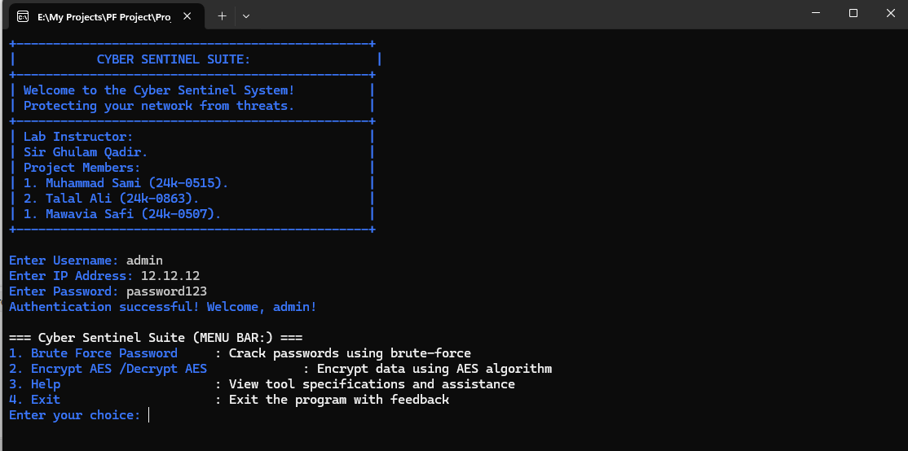

<!-- Banner with Royal Blue Typing Animation -->

  

---

# 💫 About Me:
 🎓: I’m a 2nd-year Bachelor’s student in Computer Science at the National University of Computer and Emerging Sciences (FAST), actively seeking internship opportunities to grow my skills.  🔭 I’m currently working on building strong Computer Science fundamentals through academic and personal projects.  🤝 I’m looking to collaborate on internship-level projects related to Machine Learning, Artificial Intelligence, and Data Science.  🧠 I’m looking for guidance and mentorship to better understand industry-oriented ML/AI applications and data-driven problem solving.  🌱 I’m currently learning Machine Learning, Artificial Intelligence, Data Science, and improving my programming and analytical skills.  💬 Ask me about Computer Science basics, problem-solving, or my learning journey as a CS undergraduate.  

## 🌐 Socials:
  

# 💻 Tech Stack:
   
# 📊 GitHub Stats:
 
 

## 🏆 GitHub Trophies

### ✍️ Random Dev Quote

---

<!-- Proudly created with GPRM ( https://gprm.itsvg.in ) -->
## ​ Activity Graph

  

---

##  Featured Projects

### Cyber Sentinel Suite  
A cybersecurity toolkit built in **C** for password cracking (brute-force) and AES encryption/decryption.

  

### Voice Assistant  
A **desktop voice assistant** built with **Python**, featuring voice commands for opening applications, playing music, searching Google & YouTube, reading news, taking screenshots, providing system information, and controlling system functions like lock, shutdown, or restart.

  

