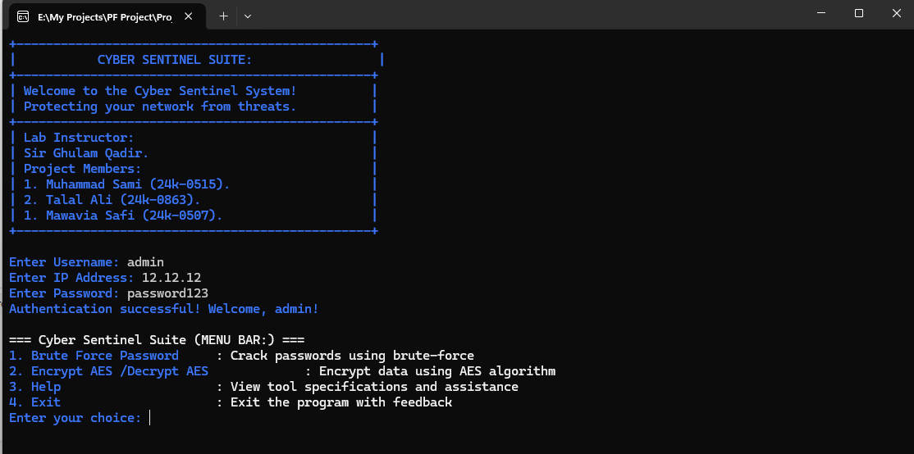

# 💫 About Me:
🎓: I'm a 2nd-year Bachelor's student in Computer Science at the National University of Computer and Emerging Sciences (FAST), actively seeking internship opportunities to grow my skills.  🔭 I'm currently working on building strong Computer Science fundamentals through academic and personal projects, spanning both AI/ML and full-stack web development.  🤝 I'm looking to collaborate on internship-level projects related to Machine Learning, Artificial Intelligence, Data Science, and Full-Stack Web Development.  🧠 I'm looking for guidance and mentorship to better understand industry-oriented ML/AI applications, data-driven problem solving, and production-grade software engineering.  🌱 I'm currently learning Machine Learning, Artificial Intelligence, Data Science, and the MERN stack, while improving my programming and analytical skills.  💬 Ask me about Computer Science basics, problem-solving, full-stack development, or my learning journey as a CS undergraduate.  

## 🌐 Socials:
- **Email:** samimemon276@gmail.com  
- **LinkedIn:** [Muhammad Sami](https://www.linkedin.com/in/muhammad-sami-02a509351/)

# 💻 Tech Stack:
         

# 📊 GitHub Stats:
 
 

## 🏆 GitHub Trophies

### ✍️ Random Dev Quote

---

<!-- Proudly created with GPRM ( https://gprm.itsvg.in ) -->

## Activity Graph

  

---

## Featured Projects

### Resume Assistant
A full-stack **MERN** application that brings resume management, job description tracking, ATS score analysis, and job application tracking into one connected workspace. Built with **React**, **Node.js**, **Express**, and **MongoDB Atlas**, with JWT-based authentication and resume parsing (PDF/DOCX). Deployed live with the frontend on **Vercel** and backend on **Render**.

🔗 [Live Demo](https://resumeassistant-lyart.vercel.app) &nbsp;|&nbsp; 💻 [Source Code](https://github.com/MSamimemon/Resume_Assistant)

  

### Cyber Sentinel Suite  
A cybersecurity toolkit built in **C** for password cracking (brute-force) and AES encryption/decryption.

  

### Voice Assistant  
A **desktop voice assistant** built with **Python**, featuring voice commands for opening applications, playing music, searching Google & YouTube, reading news, taking screenshots, providing system information, and controlling system functions like lock, shutdown, or restart.

  

